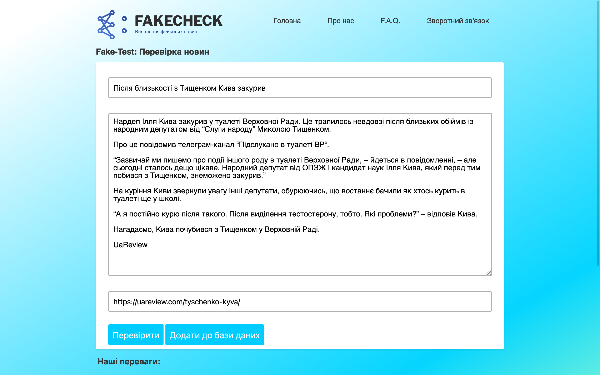
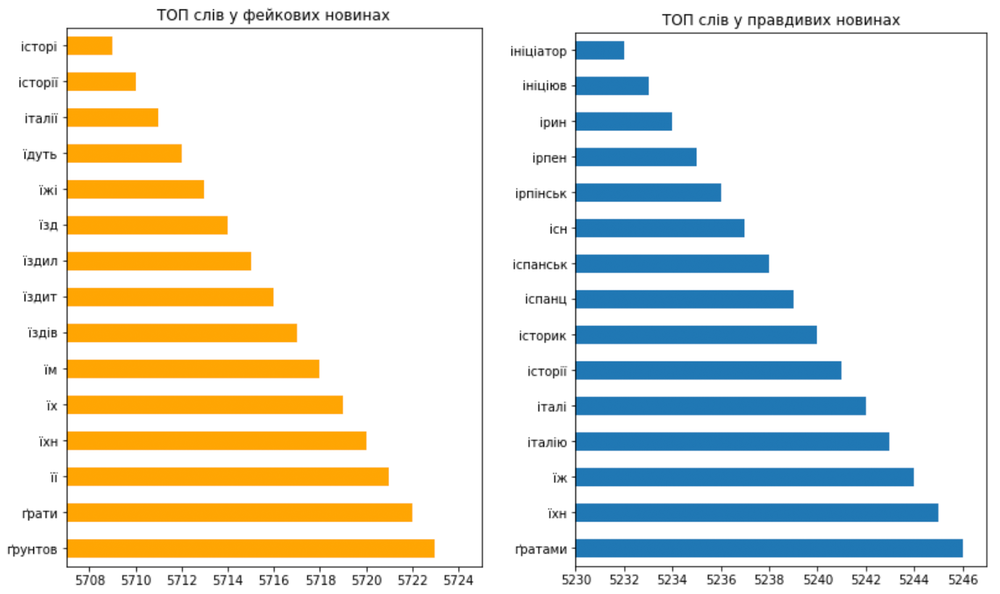
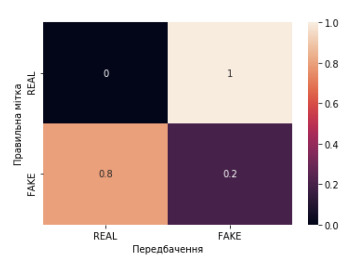
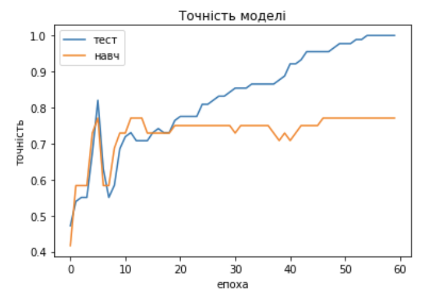

# Fake News Detection
Fake news detection with DNN.

## Installing
1. Clone this repository.
2. Go to project folder and install requirements;
```bash
pip install -r requirements.txt
```

## Usage
Run Notebook or prediction.py to start App.

App will be started at localhost:5000;

## View


## Comparing Words (Fake vs. Real)


## Confusion Matrix


## Best Model Accuracy
